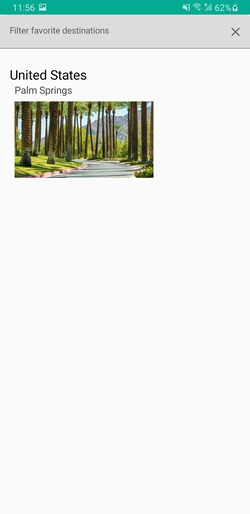

## Overview

A simple application that retrieves five random flights from (ENDPOINT) and display the results in a
ViewPager. The user can 'like' a particular destination and it will be added to favorites, in which
the user can view a list of favorite destinations.

The purpose of the README is to give a brief technical overview of the implementation along with a sample demo.

## Technologies Used

- Jetpack Compose for the UI
- Room database
- Kotlin Flow and Coroutines
- Retrofit for API requests
- Hilt for dependency injection
- Parcel to make a class parcelable and pass between activities through an Intent

## Project Structure
The project is divided into the following modules:
- **database:** Contains the implementation for all database related operations. This module is further divided into submodules as follows:
    - dao
    - entities
    - AppDatabase.kt: Creates and initializes the database on first launch, using `countriesCitiesAirports.json` file from the assets.
- **di:** Contains the implementation for data injection (hilt)
- **model:** Contains `data classes` that represent
- **network:** Module responsible for performing API requests using `Retrofit`.
    - FlightApiService: Interface that has two methods, `getFlights` and `getLocations`
    - URLs: Constants file that has all endpoints
- **ui**
- **utils:**
    - Constants
    - Extensions
    - Utils: Useful utility methods that are used across the application
- **viewmodel**

### Database
#### Structure
The data was generated using is a simple python script from this [repo](https://github.com/MChehab94/CountriesCitiesAirports) and has the followings structure:
```json
[
    {
        "name": "country_name",
        "code": "country_code",
        "cities": [
            {
                "name": "city_name",
                "country_code": "country_code",
                "airports": [
                    {
                        "name": "airport_name",
                        "iata_code": "iata_code",
                        "city": "city_name",
                        "country_code": "country_code"
                    }
                ]
            }
        ]
    }
]
```
We have a tree-like structure, in which we have an array of countries. Each country has an array of cities, and each city has an array of airports.
From this data, we can easily derive three entities:
- Country
- City
- Airport
Note that 1-M relations were not defined as there wasn't a need for them in the project. However for a larger or more complex application, defining such relations would be necessary.

Another entity is added, `Flight`, in which all retrieved flights are stored. The current usecase is to track favorite destinations. However, this can be further expanded as to show
history of requests/destinations.

### Network
`Retrofit` is used in order to perform API requests along with `GSON` in order to convert the responses into Kotlin data class.
The `FlightApiService` contains  two methods:
- `getFlights: Call<FlightResponse>`
- `getLocations: Response<LocationResponse>`

#### Get FLIGHTS
A request is sent at `/flights` endpoint in order to retrieve relevant flights, were the following parameters are used:
- fly_from
- fly_to
- partner
- limit
- one_for_city

Only the second parameter (`fly_to`) changes, all others are fixed. It would have been more convenient to have `fly_from` based on user's location, however, for simplicity,
`fly_from` is set as a constant (antalya_tr).

Note that the method returns a `Call<FlightResponse>` since if a request takes too long to finish, it's cancelled. The timeout is handled in the `FlightViewModel` (to be covered later).

#### Get Locations
A request is sent at `/locations` endpoint in order to retrieve random interesting locations. The method takes the following parameters:
- term
- limit
- location_types (defaults to "airport")

This method serves two purposes:
- Destinations are retrieved through this method on first launch (database would be still in the initialize phase)
- Retrieving destination image id

The method returns `Response<LocationResponse>`. It would've been better to return a `Call` instead as in `getFlights` method, however, I've never faced delays when calling this API, also
there's no timeout check (possible bug?) and for that has been left as a `Response`.

### FlightViewModel
Contains core logic for performing API requests along with database operations. `FlightViewModel` is responsible for:
- Retrieving flights
    - Retrieving random (unvisited) cities/destinations from database. In case non exist, `getLocations` is used instead.
    - Sending a request to the `/flights` API, passing comma separated airport iata codes
- Handling timeout
- Handling refresh by sending a new request (if none is currently running)
- Adding/removing destination to/from favorites


## Application Overview

### First Launch
The figure below is an overview on first launch:

<p align="center">
   
</p>

### Favorite List
Upon clicking on the 'heart' icon on te toolbar, the user's redirected to the following page:

<p align="center">
  
</p>

The user can add a destination to favorites and can then view it in the favorites list as follows:

<p align="center">
   
</p>

### Refresh
The user can refresh the list (swipe to refresh) and another five random flights will be displayed.

<p align="center">
   
</p>


### Filter
The user can filter for one or more destinations by clicking on the top right icon, where s/he will be redirected to the following screen:

<p align="center">
     
</p>

Once done, the user clicks on 'Apply', where a request with the selected destinations is sent and the new results are displayed:

<p align="center">
     
</p>


In case no selections were made, the following error will be displayed:

<p align="center">
    
</p>

### More Favorites
The user can add/remove as many destinations into his/her favorites, in which all will be displayed in the favorites screen:

<p align="center">
     
</p>

<p align="center">
    
</p>

Finally, the user can filter through their favorites list:

<p align="center">
    
</p>

And in case no results match the query, the following message is displayed:

<p align="center">
    
</p>


